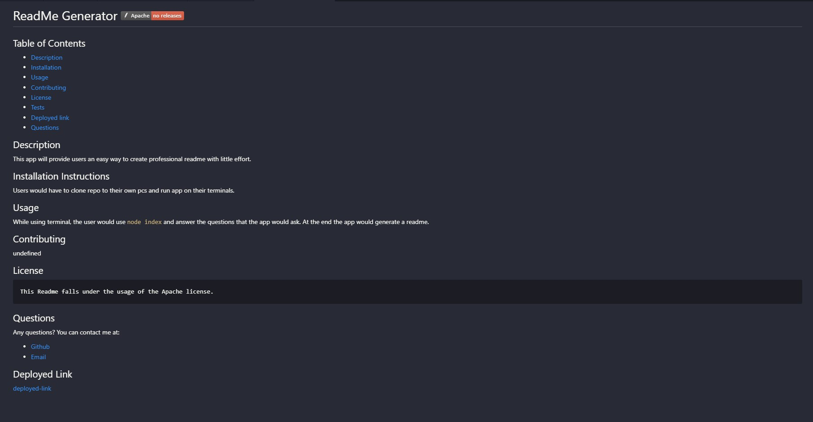

# EZ ReadMe Generator 

## Description
This script will provide users an easy way to create professional readme with little effort. This basic app is created with just java script for node. The node js would then prompt users to answer a series of questions that would then create areadme based on their inputs. The javascript also appends the text content from other javascript files via modularization and template literals.

## Below is a screenshot of a user generated readme via generator.

## Demo
Below is also a short video demonstration of how a user would operate the generator.

## Deployed Link
- [Github link](https://github.com/ArmandoUg/Homework-7)